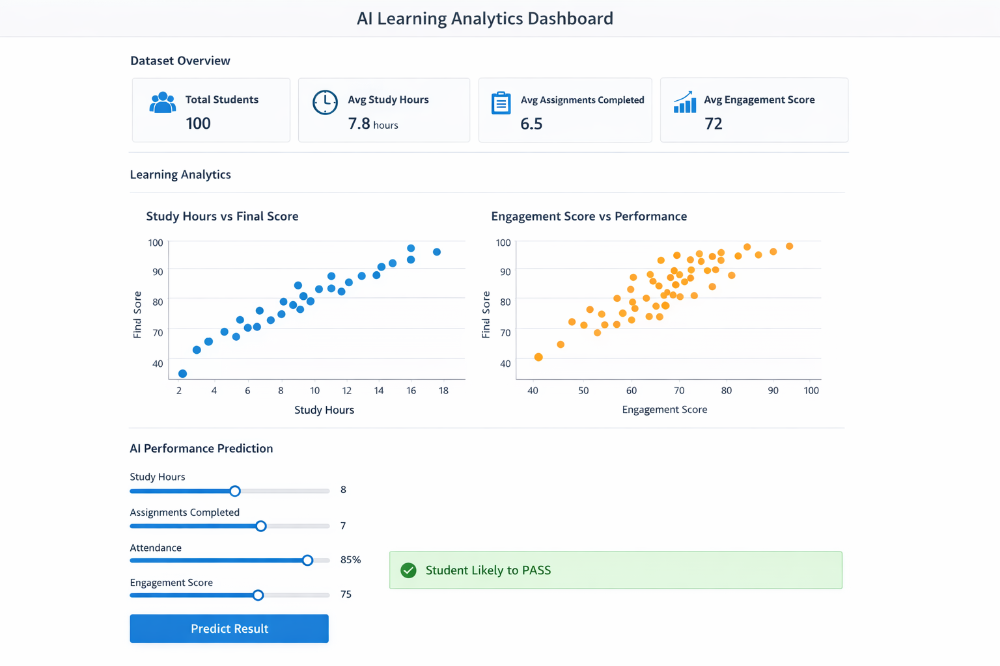

# AI Learning Analytics Dashboard

This project analyzes student learning behavior and predicts academic success using machine learning.

Features:
- Student learning data analysis
- Interactive visualization dashboard
- AI model predicting student success
  
  ## Demo Dashboard

Tech Stack:
Python
Streamlit
Scikit-learn
Pandas
Matplotlib

Run Project:

pip install -r requirements.txt
streamlit run app/dashboard.py

Project Use Case:

Learning analytics systems are used in education to monitor engagement, predict outcomes, and improve learning experiences.
